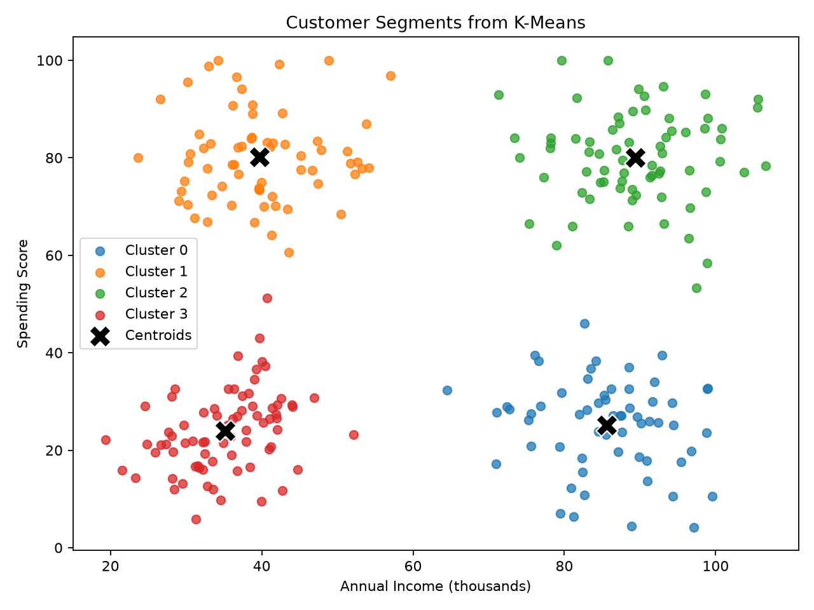
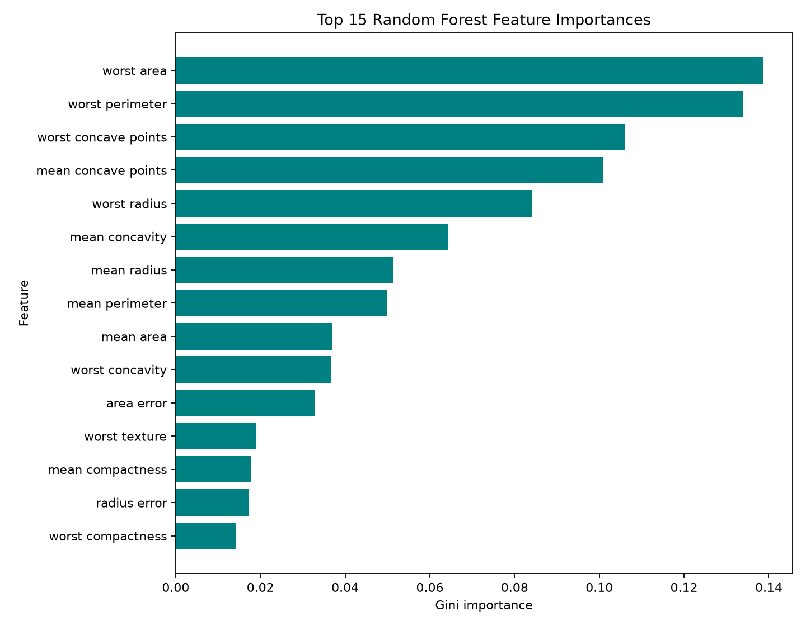
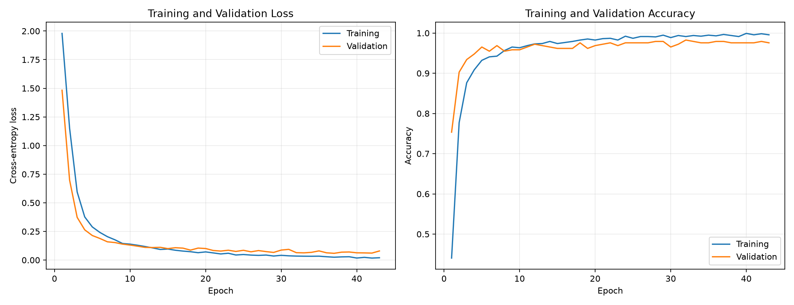

# Codveda Machine Learning Tasks

A complete, reproducible portfolio of all nine Codveda machine-learning tasks across the Basic, Intermediate, and Advanced levels.

## Project highlights

- Nine independently runnable Python projects in one repository.
- End-to-end workflows covering preprocessing, training, tuning, evaluation, and visualization.
- Reproducible random seeds and leakage-safe train/test or cross-validation pipelines.
- Generated datasets, predictions, metrics, reports, charts, and a saved Keras model.

## Tasks and verified results

| Level | Task | Dataset | Key result | Project |
|---|---|---|---|---|
| 1 - Basic | Data preprocessing | Customer demo data | Imputation, encoding, scaling, 80/20 split | [Task 1](Task_1_Data_Preprocessing) |
| 1 - Basic | Simple linear regression | Diabetes | R-squared 0.2334; MSE 4061.83 | [Task 2](Task_2_Linear_Regression) |
| 1 - Basic | KNN classification | Iris | Accuracy 96.67%; best K = 1 | [Task 3](Task_3_KNN_Classifier) |
| 2 - Intermediate | Logistic regression | Customer churn | ROC-AUC 0.7378; churn recall 65.52% | [Task 4](Task_4_Logistic_Regression) |
| 2 - Intermediate | Decision tree | Iris | Accuracy 96.67%; macro F1 0.9666 | [Task 5](Task_5_Decision_Tree) |
| 2 - Intermediate | K-Means clustering | Customer segments | K = 4; silhouette 0.6956 | [Task 6](Task_6_KMeans_Clustering) |
| 3 - Advanced | Random Forest | Breast cancer | Accuracy 96.49%; malignant F1 0.9512 | [Task 7](Task_7_Random_Forest) |
| 3 - Advanced | SVM classification | Breast cancer | Linear accuracy 99.12%; ROC-AUC 0.9964 | [Task 8](Task_8_SVM_Classification) |
| 3 - Advanced | TensorFlow/Keras network | Digits | Accuracy 98.06%; macro F1 0.9804 | [Task 9](Task_9_Neural_Network) |

## Quick start

```powershell
git clone https://github.com/AdhamEwaida/codveda-machine-learning-tasks.git
cd codveda-machine-learning-tasks
python -m venv .venv
.\.venv\Scripts\Activate.ps1
python -m pip install -r requirements.txt
```

Run any task from the repository root:

```powershell
python .\Task_1_Data_Preprocessing\task1_preprocessing.py
python .\Task_2_Linear_Regression\task2_linear_regression.py
python .\Task_3_KNN_Classifier\task3_knn_classifier.py
python .\Task_4_Logistic_Regression\task4_logistic_regression.py
python .\Task_5_Decision_Tree\task5_decision_tree.py
python .\Task_6_KMeans_Clustering\task6_kmeans_clustering.py
python .\Task_7_Random_Forest\task7_random_forest.py
python .\Task_8_SVM_Classification\task8_svm_classification.py
python .\Task_9_Neural_Network\task9_neural_network.py
```

Each script writes its generated artifacts to its own `outputs` directory.

## Selected visual results

### K-Means customer segments



### Random Forest feature importance



### Neural-network learning curves



## Repository structure

```text
Machine_Learning_Tasks/
|-- Task_1_Data_Preprocessing/
|-- Task_2_Linear_Regression/
|-- Task_3_KNN_Classifier/
|-- Task_4_Logistic_Regression/
|-- Task_5_Decision_Tree/
|-- Task_6_KMeans_Clustering/
|-- Task_7_Random_Forest/
|-- Task_8_SVM_Classification/
|-- Task_9_Neural_Network/
|-- requirements.txt
`-- README.md
```

## Data and reproducibility

Tasks 2, 3, 5, 7, 8, and 9 use datasets bundled with scikit-learn. Tasks 1, 4, and 6 create documented synthetic datasets with fixed random seeds because the original supplied archives were unavailable. Random splits, model initialization, and cross-validation use fixed seeds where applicable.

The full repository was rerun and verified on Windows with Python 3.13. Install the versions resolved from `requirements.txt` for another environment.
